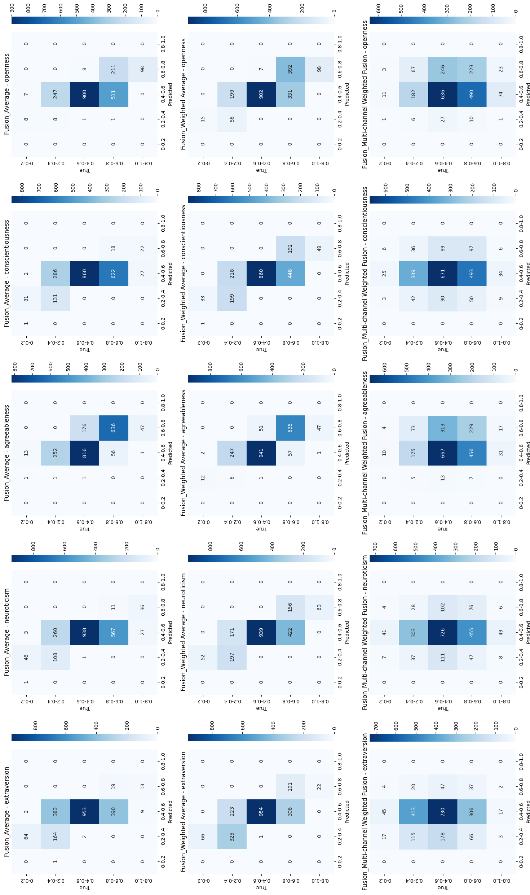

# Charisma-Predictor: Multi-Modal AI for Personality & Leadership Assessment

This project builds a multi-modal AI pipeline to estimate **Big Five personality traits** from **audio, video, and text**, and to map those traits to a **charismatic leadership score**. It was developed as part of an MSc AI group project at Maastricht University.

🧠 This GitHub repository includes **only the parts I personally implemented**: the **video model**, the **fusion system**, and the **leadership scoring + visualization**.

---

## 🚀 Highlights

* 🎥 Video: facial landmark tracking via MediaPipe + five sequence models (CNN, LSTM, GRU, Transformer, TCN)
* 🤖 Video outputs ensembled via weighted averaging (best MAE: 0.1189)
* 🔀 Fusion: weighted averaging and Multi-Channel Weighted Fusion (MCWF)
* 📈 Output: Big Five personality prediction + charisma score ∈ \[0, 1] with classification (Very Low → Very High)
* 📊 Visualization of leadership score distribution and model performance
* ✅ Achieved up to **92.45% accuracy** on Big Five personality traits via fusion model (MCWF)

---

## 📊 Sample Output

**Leadership Suitability Distribution:**


**Fusion Model Personality Accuracy (MCWF):**



---

## 👤 My Contribution

This repository reflects the parts of the project I directly implemented:

* Developed the full **video model** pipeline: feature extraction, five-model architecture (CNN, LSTM, GRU, Transformer, TCN), ensemble fusion, evaluation
* Designed and implemented **fusion logic**, including simple averaging, weighted fusion, and trait-specific MCWF
* Developed the charisma scoring system based on normalized Big Five correlations
* Produced evaluation results, metrics, and visualizations (e.g., final histograms)

---

## 📁 Project Structure

```
charisma-predictor/
├── video_model/            # My code for facial landmark + sequence model ensemble
├── fusion/                 # My code for fusion logic (weighted avg, MCWF)
├── figures/                # Output plots (confusion matrices, histograms)
├── results/                # Personality predictions + charisma scores
├── text_and_audio/         # References to group members' implementations
│   └── README.md           # External links only (not my code)
├── report_links/           # Final team report PDF link
│   └── README.md
├── README.md               # You're reading it
└── requirements.txt
```

---

## 📎 Related Work by Team Members

While I did not implement the audio and text models, they contributed to the fusion output. You can find their work here:

* 📄 [Full project report (PDF)](https://drive.google.com/file/d/1LQnHQryJfcT02PuWKHqSIbIRdy0jVY7T/view?usp=sharing)
* 🔊 [Audio model code & description](https://drive.google.com/drive/folders/1SoNqgf6J3f-QCa_LvFf0fSnW1xZLOgCV?usp=drive_link)
* 📝 [Text model code & description](https://drive.google.com/drive/folders/1npBfmOsTbw5ziEsa_PnD_drb8xST2BSP?usp=drive_link)

---

## 🛠️ Run the Fusion Module

```bash
pip install -r requirements.txt
python fusion/run_mcwf.py
```

---

## 📄 Dataset

* [First Impressions Dataset](https://chalearnlap.cvc.uab.cat/dataset/20/description/) – 10,000 annotated video clips

---

## 🧠 Methodology Summary

* Video: MediaPipe landmark sequences → five models (CNN, LSTM, GRU, Transformer, TCN) → trait-level scores → ensembled via weighted average
* Audio/Text: pretrained AST / BERT models → Big Five scores (via linked repos)
* Fusion: average, weighted, MCWF → leadership score mapping (0–1)
* Classification into 5 buckets: Very Low → Very High suitability

---

## 📌 Final Grade

This project received a final mark of **8.5 / 10**.

---

## ⚠️ Disclaimer

This repository contains only the work I personally implemented. Please refer to linked resources for other group contributions.
